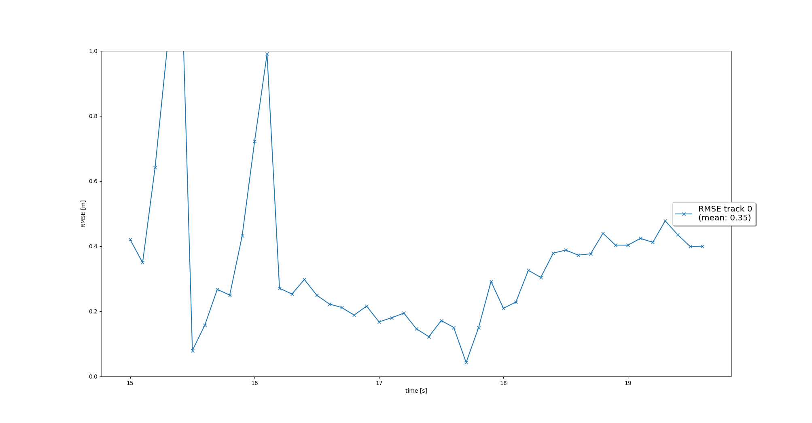
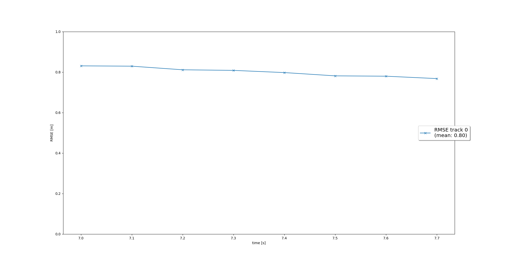
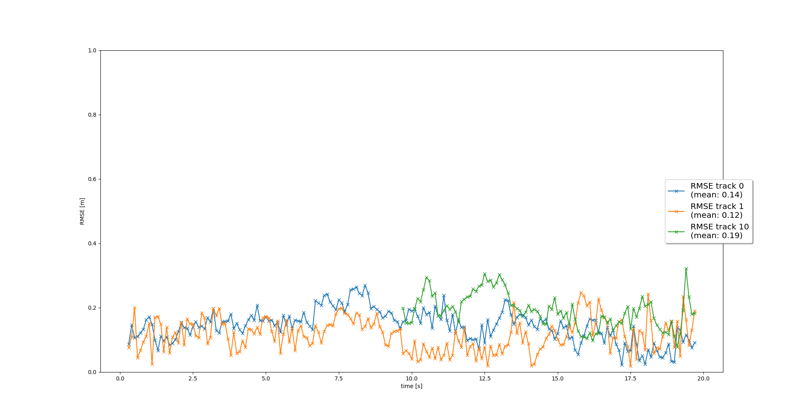
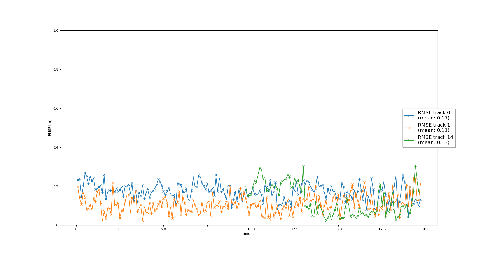

`# Sensor Fusion and Object Tracking: Final Project

## Step 1: Tracking objects with a Extended Kalman Filter

- State transition matrix <b>F</b> is initialized.
- Process noise covariance <b>Q</b> is initialized with q pramameter chosen by the expected maximum change in velocity.
- Predict tracked object's state <b>x</b> and estimation error covariance <b>P</b> with related measurement. 
- Tracked object's state <b>x</b> is updated with process noise covariance <b>Q</b>.

#### RMSE result:

## Step 2: Track management(Initialize, update, delete)

- Sensor coordinates and transfered to vehicle coordinates.
- Initialize track state from measurement by multiplying rotational matrix <b>M_rot</b> , measurement noise covariance matrix <b>R</b> and transpose of rotational matrix <b>M_rot^T</b>.
- Initialize velocity estimation matrix with corresponding <b>sigma squared</b>.
- Initialize the whole estimation error covariance <b>P</b> with adove track state and velocity estimation matrix.
- The track score is increased or decreased based on the measurement assignment to the initialized track.
- The track is deleted if the track score is below the threshold or the estimation error covaiance <b>P</b> of the track is too big. 

#### RMSE result:

## Step 3: Data Association

- <b>Association matrix</b> is initialized with the unassigned track list and unassigned measurement list.
- From each element in unassigned tack and unassigned measurement lists, Mahalanobis Distance <b>MHD</b> is computed which considers the size of covariance.
- <b>Association matrix</b> entry is updated with corresponding <b>MHD</b> if it lies inside a track's gate, otherwise set to infinity. <b>Gating</b> reduces the association complexity by removing unlikely pairs.
- Once <b>Association matrix</b> is built, minimum <b>MHD</b> entry is used to assign measurement to the track and related row and column are removed. This is repeated until the matrix is empty.

### RMSE result:

## Step 4: Sensor Fusion

- Nonlinear camera measurement function <b>hx</b> is implemented by transforming the position estimate from vehicle to camera coordinates, then camera to image coordinates.
- Camera measurement is initialized. 
- The function <b>in_fov</b> checks wether x lies in the sensor's FOV(field-of-view) or not. 

### RMSE result:

## Questions

<em><b>Do you see any benefits in camera-lidar fusion compared to lidar-only tracking?</b></em>

The benefit of camera-lidar fusion is the redundancy. Sensor fusion system provides sensors with different Field-of-views. The target object might be occuluded for one of the sensors, however measurement of the target position might be possible with the other sensor. 
Also, the sensor fusion system can navigate itself in various conditions(lighting, weather etc). i.e. When it is at night or low light condition, the camera would significantlly lose information, however, since the lidar emmits its own light beam to measure, it is not effected by the condition.    

<em><b>Which challenges will a sensor fusion system face in real-life scenarios? Did you see any of these challenges in the project?</b></em>

The real-life challenges for a sensor fusion system might be sensor mounting and aligment. With a single sensor system, misalignment can be compensated by recalculating with the offset, however, with two or more sensor system, misalignment in each sensor can cause significant uncertainty of target position. Therefore sensor mounting and calibration must be performed with precision.

<em><b>Can you think of ways to improve your tracking results in the future?</b></em>
Additional sensor such as radar can increase the number of measurements and reduce occulusions. Also, using different assiciation matrix such as [GNN](http://ecet.ecs.uni-ruse.bg/cst/docs/proceedings/S3/III-7.pdf) or [PDA](https://www.researchgate.net/publication/224083228_The_probabilistic_data_association_filter) may increase the tracking performance.

